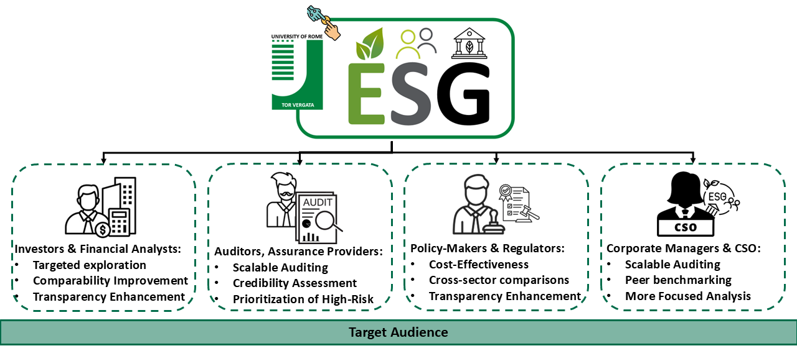
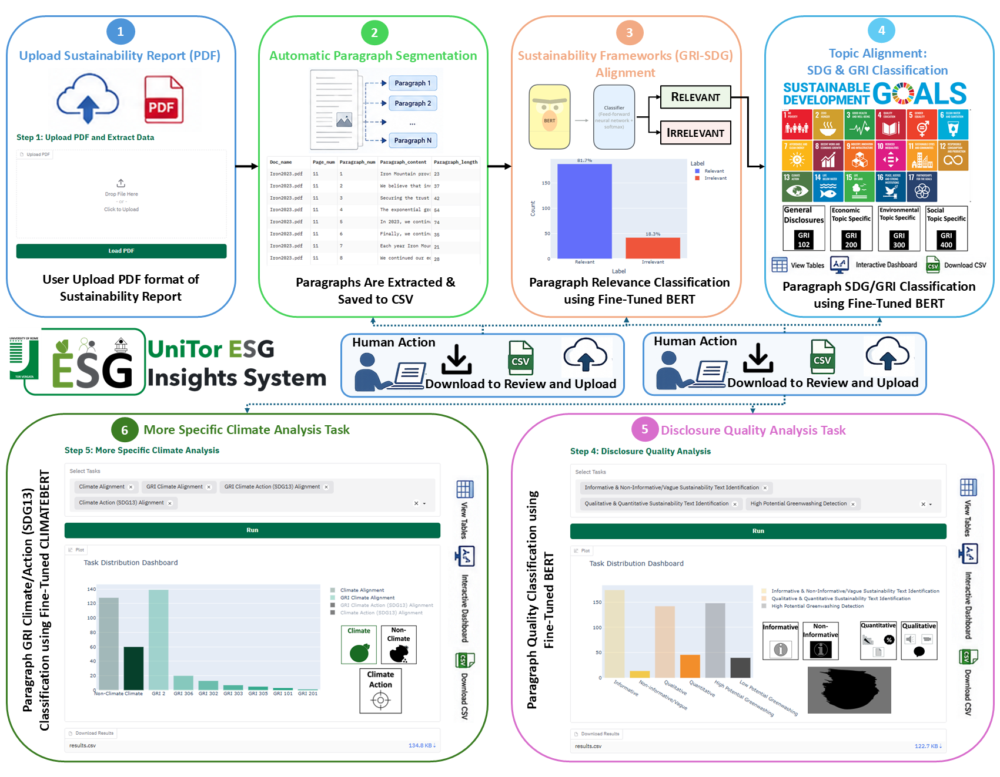

# UniTor ESG Insights

Companion repository for the paper (UniTor ESG Insights: An Interactive Human-in-the-Loop System for Traceable Sustainability Report Analysis) accepted at [CIKM 2026](https://cikm2026.diag.uniroma1.it/), Rome, ITALY. 

## Table of Contents
- [Overview](#overview)
- [Quick Start](#quick-start)
- [Workflow](#workflow)
- [Tasks and Experimental Results](#tasks-and-experimental-results)
- [Hugging Face Deployment](#hugging-face-deployment)
- [Demo Video](#demo-video)
- [Repository Structure](#repository-structure)
- [License](#license)

## Overview
### An Interactive Human-in-the-Loop System for Traceable Sustainability Report Analysis
UniTor ESG Insights is a **human-in-the-loop ESG analysis system** that performs **traceable, paragraph-level sustainability report analysis**.
Unlike document-level ESG classifiers, this system is designed around a **bottom-up evidence workflow**, where every prediction can be traced back to the original paragraph in the source PDF. The system transforms a sustainability report into:

**PDF → Paragraph Units → ESG Classifiers → Interactive Evidence Layer → Aggregation Dashboards**

Every output (SDG, GRI, disclosure quality, climate relevance) is:

- Linked to original paragraph text
- Linked to page number in the PDF
- Exportable as structured CSV
- Editable and re-runnable by the user

This enables **inspection, correction, and re-aggregation of ESG predictions**. The analyst can optionally correct or refine paragraph-level predictions in the exported CSV and re-upload the updated file, allowing the system to propagate these corrections to downstream visualizations and dashboard-level aggregations:

1. Upload PDF sustainability report  
2. Extract paragraph-level units (with provenance)  
3. Run ESG classifiers (SDG, GRI, quality, climate)  
4. Inspect predictions at the paragraph level  
5. Correct outputs manually (CSV editing)  
6. Re-upload corrected data  
7. Re-run downstream analysis  
8. Generate final traceable dashboards

### Target Audience

The system is designed to support multiple stakeholder groups involved in ESG reporting, analysis, assurance, and decision-making:

  - **Investors & Financial Analysts:** Retrieve, compare, and explore evidence across ESG topics and sustainability disclosures.
  - **Auditors & Assurance Providers:** Identify weak, generic, or insufficiently supported disclosures and prioritize review efforts.
  - **Policy Makers & Regulators:** Monitor disclosure patterns, reporting practices, and ESG trends across companies, sectors, or reporting periods.
  - **Corporate Sustainability Managers & Chief Sustainability Officers (CSOs):** Detect reporting gaps, assess disclosure quality, and improve sustainability reporting practices.

## Quick Start
### 🌐 [Live Demo](https://huggingface.co/spaces/sag-uniroma2/UniTorESGInsights)

No installation required. All [models](https://hf.co/collections/sag-uniroma2/unitoresginsights) are automatically loaded from Hugging Face Hub.

## Workflow
The UniTor ESG Insight System implements a Human-in-the-Loop interactive workflow that transforms raw sustainability report PDFs into structured, multi-level ESG insights. The system supports both fully automated processing and user-driven correction/refinement at every stage.

### Human-in-the-Loop Interactive Workflow Overview

<p align="center">
  
</p>

---

### 1. PDF Ingestion & 2. Automatic Paragraph Extraction

Users begin by uploading PDFs of sustainability reports. The system automatically:

- Extracts text at the paragraph level
- Preserves document-page structure
- Converts extracted content into an intermediate CSV format

Users can:
- Preview extracted paragraphs per page (next/previous navigation)
- Download the CSV for quality inspection
- Optionally modify, merge, split, or remove paragraphs
- Alternatively, upload a manually prepared CSV as input (skipping PDF extraction)

This ensures flexibility between fully automated and user-curated datasets.

---

### 3. Sustainability Framework (GRI–SDG) Alignment

Once a clean paragraph dataset is available, the system performs:

- Classification of Relevant vs Irrelevant ESG content based on GRI–SDG standards
- Visualization of class distribution (relevant vs irrelevant)

Users can:
- Download annotated CSV outputs
- Validate and refine selected relevant samples
- Re-upload corrected datasets for improved downstream analysis

---

### 4. Topic Alignment: SDG & GRI Classification 

Filtered relevant paragraphs are passed to fine-grained topic models for:

- SDG classification
- GRI topic classification
    
The system provides:
- Interactive dashboards with filtering by SDG or GRI categories
- Table-based inspection of predictions
- CSV export for external validation

---

### 5. Disclosure Quality Analysis

The system analyzes *how ESG information is communicated*, not only what is reported. This includes:

- Informative vs non-informative (vague) classification  
- Qualitative vs quantitative disclosure detection  
- High vs low potential blue and greenwashing risk signals detection  

Users can:
- Run one or multiple quality tasks independently
- Interpret separate outputs per task (since models are independently trained)
- Download structured CSV files for each analysis
- Explore results via interactive dashboards

---

### 6. Climate-Focused ESG Analysis

The system provides specialized climate-related ESG analysis, including:

 - Climate Relevance Classification
 - GRI Climate Category Alignment
 - Climate Action (SDG 13) Alignment
 - GRI Climate Action Alignment 

Users can:
- Filter climate-related paragraphs
- Combine multiple climate tasks for comparative interpretation
- Visualize results through interactive dashboards
- Export climate-specific annotated datasets

---

### Output and Exploration Layer

For each stage, the system provides:

- Downloadable CSV files
- Interactive dashboards with filtering and visualization
- Task-specific outputs (GRI, SDG, quality, climate)
- Re-upload capability for iterative refinement
- Traceable navigation from summary → paragraph evidence

This enables a cyclical workflow where users continuously refine data quality and analysis outcomes.

## Tasks and Experimental Results
All models are fine-tuned Transformer-based architectures and are dynamically loaded into the Gradio-based application via Hugging Face integration. The system evaluates multiple ESG-related classification and analysis tasks across paragraphs of sustainability reports:

- Sustainability Framework Alignment ([SA_MODEL](https://huggingface.co/sag-uniroma2/SA_MODEL))
- Topic Alignment:
  - SDG Classification ([SDG_MODEL](https://huggingface.co/sag-uniroma2/SDG_MODEL))
  - GRI Topic Classification ([GRITopics_MODEL](https://huggingface.co/sag-uniroma2/GRITopics_MODEL))
- Disclosure Quality Analysis:
  - Informative vs Non-Informative (Vague) Detection ([INFVague_MODEL](https://huggingface.co/sag-uniroma2/INFVague_MODEL))
  - Qualitative vs Quantitative Disclosure Classification ([QQ_MODEL](https://huggingface.co/sag-uniroma2/QQ_MODEL))
  - High Potential Greenwashing Detection as Weak-Disclosure Risk Proxy ([HPGW_MODEL](https://huggingface.co/sag-uniroma2/HPGW_MODEL))
- Climate-Related ESG Analysis:
  - Climate Relevance Classification ([Climate_MODEL](https://huggingface.co/sag-uniroma2/Climate_MODEL))
  - GRI Climate Category Alignment ([GRIClimate_MODEL](https://huggingface.co/sag-uniroma2/GRIClimate_MODEL))
  - Climate Action (SDG 13) Alignment ([ClimateActionSDG13_MODEL](https://huggingface.co/sag-uniroma2/ClimateActionSDG13_MODEL))
  - GRI Climate Action Alignment ([GRISDG13_MODEL](https://huggingface.co/sag-uniroma2/GRISDG13_MODEL))

All [trained models](https://hf.co/collections/sag-uniroma2/unitoresginsights) are hosted on Hugging Face and are dynamically loaded into the Gradio interface to enable real-time ESG paragraph-level analysis across all tasks.

## Hugging Face Deployment

Implemented using **Gradio** and deployed on **Hugging Face Spaces**. The [system](https://huggingface.co/spaces/sag-uniroma2/UniTorESGInsights) is fully deployed via Hugging Face Spaces, allowing direct execution of the pipeline and interactive demonstration without local setup using free-tier infrastructure:

- CPU: 2 vCPU / 16 GB RAM
- GPU: ZeroGPU (on-demand NVIDIA H200 access)
- Automatic sleep after inactivity (48 hours)

The architecture is fully compatible with both CPU and GPU environments.

## Demo Video
### 🎬 [Demo Video](https://youtu.be/Ycc0ZOBV5AA)

## Repository Structure

```bash
UniTor ESG Insight System/
│
├── app.py
├── requirements.txt
├── README.md
│
├── configs/
│   ├── model_config.py
│   └── sdg_labels.py
│
├── models/
│   ├── classifier.py
│   ├── sdg_classifier.py
│   ├── model_loader.py
│   └── predictor.py
│
├── pdf_processing/
│   └── pdf_utils.py
│
├── ui/
│   ├── gradio_functions.py
│   ├── filters.py
│   ├── charts.py
│   ├── state.py
│   ├── theme.py
│   └── interface.py
│
└──  assets/
    ├── logo.png
    ├── workflow.png
    ├── targetaudience.png
    │
    ├── sdg_icons/
    ├── gri_icons/
    ├── quality_icons/
   └── climate_icons/
```

## License
This project is released under the [Apache License 2.0](https://www.apache.org/licenses/LICENSE-2.0).

